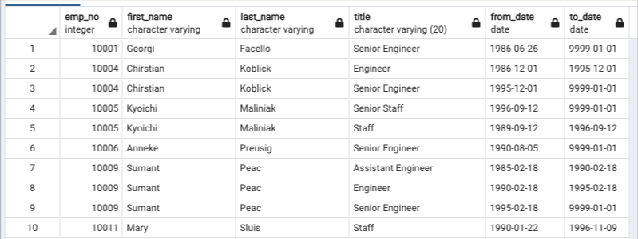

# Pewlett-Hackard-Analysis
## Overview of the analysis 

In this work, an analysis on the data base which is construcred by six csv documents obout employees, departments, salaries and job titels of a large company Pewltt Hackard was made by using postgreSQL methods suc as JOIN mathod, DISTINCT ON () method, GROUP BY method and ORDER BY method. The codes of queries can be found in the sql document named .

There are four outputs of the study as csv documents; retirement by titles which contains some repeating employees who worked in more then one jop for the campany, unique titels which contains employees based on the last jop that they did for the company, retiring titles which contains numbers of retiring employees by jop titles and membership eligibility which contains eligible employees for mentorship program.

In this report these documents are analysised and results are presented and discussed. In the summary, some more queries are added to go into the deeper 
analysis to give idea to the manager of the company.

### Purpose

The purpose is determine the number of retiring employees per title, and to identify employees who are eligible to participate in a mentorship program.

## Results

### 1. Retirement by titles 
We create retirement by titles by joining two tables, employees and titles, it is done by the following query:

> SELECT  e.emp_no,
> 
>        e.first_name,
>        
>       e.last_name,
>		
>       ti.title,
>       
>       ti.from_date,
>      
>       ti.to_date  
>            
> INTO retirement_titles
>     
> FROM employees AS e
>      
> INNER JOIN titles AS ti  ON (e.emp_no = ti.emp_no)
> 
> WHERE (e.birth_date BETWEEN '1952-01-01' AND '1955-12-31')
> 
> ORDER BY e.emp_no;

The head rows of the table is given in the following table:

If we look at the table, some employees are repeating. This is because they have switched titles over the years.
These dublicates are needed to be removed. It will be done in the next section.

### 2. Removing dublicates

We remove dublicates by using DISTINCT ON () method. The query is as follows:

> SELECT DISTINCT ON (rt.emp_no)
> 
>          rt.emp_no,
>          
>          rt.first_name,
>          
>	         rt.last_name,
>	         
>		       rt.title
>		       
> INTO unique_titles	
> 	  
> FROM retirement_titles AS rt
> 
> WHERE to_date='9999-01-01'
> 
> ORDER BY rt.emp_no ASC,
> 
>          rt.to_date DESC;

In this inquery we create unique_titles table which contains entieremnt employees per titles, we keep only the most recent title of each employe.

The head rows of the table is the following:

## Summary:
